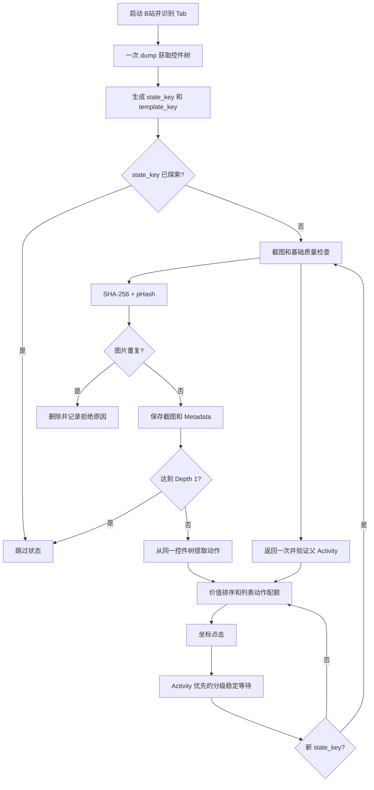

# Original 与 Optimized 算法流程及实测结论

## 一、比较范围

本结论只比较两个实际 Android 目录：

| 版本 | 目录 | 定位 |
|---|---|---|
| Original | `crawler_original/` |飞哥 GitHub 原版|
| Optimized | `crawler_optimized/` | 我最终优化的状态感知算法版 |


测试对象为 MuMu 模拟器中的 B站 9.4.0：

```text
设备：127.0.0.1:5555
系统：Android 12
分辨率：1440x2560
包名：tv.danmaku.bili
```

## 二、算法具体变化

【BFS + dHash】 变为 【状态感知的有界遍历 + 感知图像去重】

| 维度 | Original | Optimized | 优化原因 |
|---|---|---|---|
| 页面状态 | 主要依赖 Activity | Activity + 规范化控件树 `state_key` | 识别同 Activity 的 Tab、Fragment、弹窗和内容状态 |
| 模板识别 | Activity 路径和连续链 | 独立 `template_key`，忽略动态文本和列表内容 | 阻止同模板推荐链持续深入 |
| 遍历策略 | 默认 Depth 3 的递归 DFS | 默认 Depth 1 的宽度优先状态采集 | 实测深层回退成本高于新增有效图收益 |
| 动作获取 | 每节点读取多个 Poco 属性 | 一次 hierarchy dump 后本地提取 | 减少跨进程 RPC |
| 动作选择 | 简单排序后逐个点击 | 价值排序、列表动作配额、深层动作预算 | 优先获得高信息增益状态 |
| 页面等待 | 固定 sleep | Activity 优先、控件树按需采样 | 快页面少等，Activity 不变时仍能识别状态变化 |
| 返回恢复 | 按 Activity 多次返回 | 一次返回优先，目标 Activity 验证，模板偏差记录 | 避免严格状态比较导致连续返回和越退 |
| 探索去重 | 截图与遍历去重缺少完整闭环 | `state_key` 防环 | 防止重复探索同一 UI 状态 |
| 图片去重 | 遍历阶段不做实际图片去重 | SHA-256 + 64-bit pHash | 在写入 Metadata 前拒绝完全重复和近重复 |
| 安全边界 | 深度、动作、时间限制 | 深度、状态、动作、截图、时间联合限制 | 动态 App 状态空间不能无边界遍历 |
| 指标 | 只有最终截图和点击数 | 状态、动作、转移、等待、截图、去重和恢复指标 | 能定位效率损失来源 |

## 三、为什么最终 Android 默认 Depth 1

Depth 3 理论上能到达更多层级，但 B站实际页面中存在大量视频详情推荐链：

```text
视频详情 A
→ 推荐视频详情 B
→ 推荐视频详情 C
→ ...
```

深层递归增加了返回链长度、父状态恢复失败和 App 重启。前期 Depth 实验中：

| 指标 | Depth 1 | 有界 Depth 3 |
|---|---:|---:|
| 去近重图片/小时 | 430.4 | 239.7 |
| 动作/截图 | 1.59 | 2.67 |
| 唯一 Activity | 19 | 13 |
| 回退耗时 | 5.1 秒 | 78.1 秒 |
| App 重启 | 0 | 12 |

因此最终 Android 默认策略是：

```text
先完成首页和各 Tab 的横向覆盖
父状态允许点击
子状态截图并识别同 Activity 变化
子状态默认不继续点击孙页面
深度 2/3 作为按 App、按模板开启的可选策略
```

Optimized 仍保留状态图、模板识别、优先级、分级等待、
父状态校验和截图 pHash

## 四、最终流程



## 五、做Optimized的优化路径

### V0：原始 Optimized

- Depth 3；
- 每轮高频完整 hierarchy dump；
- 父状态要求精确 `state_key` 相等

120 秒烟测：

```text
去近重图/小时：239.7
唯一 Activity：2
hierarchy dump：125 次，32.6 秒
重启：6 次
```

### V1：分级等待和模板动作预算

- Activity 先行检测；
- Activity 不变时才读取控件树；
- 深层动作递减；
- 同模板连续深入限制

120 秒烟测：

```text
去近重图/小时：269.6
唯一 Activity：6
hierarchy dump：57 次，16.5 秒
重启：4 次
```

### V2：一次返回优先

- 返回后命中目标 Activity 即接受；
- 模板偏差只记录，不连续盲目返回

该版本提高了状态产出，但 Depth 2/3 仍有明显恢复成本

### V3：Depth 2

120 秒烟测：

```text
去近重图/小时：299.6
唯一 Activity：3
重启：5 次
```

吞吐提高，但覆盖和稳定性仍未达到目标

### V4：最终 Depth 1 状态图

- 先横向覆盖；
- 子状态截图，不继续点击孙页；
- 保留同 Activity 状态识别和实际图片去重

进入正式 AB/BA 后，吞吐、覆盖和稳定性同时优于 Original

## 六、正式 Android AB/BA 实验

实验目录：

```text
android_original_optimized_results/final_abba_2x180/
```

实验顺序：

```text
第 1 组：Original → Optimized
第 2 组：Optimized → Original
每次最长 180 秒
```

两组均使用相同模拟器、账号、B站版本、分辨率和网络

### 单次结果

| 运行 | 截图 | 去近重图片 | 去近重图片/小时 | Activity | 重启 |
|---|---:|---:|---:|---:|---:|
| Original 第1次 | 10 | 8 | 159.7 | 5 | 2 |
| Optimized 第1次 | 23 | 23 | 459.6 | 11 | 1 |
| Optimized 第2次 | 17 | 17 | 339.6 | 7 | 0 |
| Original 第2次 | 15 | 14 | 279.5 | 10 | 4 |

### 中位数结果

| 指标 | Original | Optimized | 变化 |
|---|---:|---:|---:|
| 截图/小时 | 249.6 | 399.6 | **+60.1%** |
| dHash 去近重图片/小时 | 219.6 | 399.6 | **+82.0%** |
| dHash 近重复占比 | 13.3% | 0.0% | **-100%** |
| 唯一 Activity | 7.5 | 9.0 | **+20.0%** |
| App 重启次数 | 3.0 | 0.5 | **-83.3%** |

Optimized 两次运行都保存了实际截图和对应 Metadata：

```text
第1次：23 张截图，23 条 Metadata
第2次：17 张截图，17 条 Metadata
```

## 七、结果分析

### 最看重的效率

统一离线 dHash 去近重后，Optimized 中位数为 399.6 张/小时，Original 为
219.6 张/小时，提升 82.0%。这比只比较原始截图数更接近项目的有效产出目标

### 第二点覆盖率

Optimized Activity 中位数提高 20%，且两次运行分别识别 11 和 15 个
同 Activity 状态转移。说明 Depth 1 没有简单降低覆盖，而是通过状态识别获得
Original 会漏掉的 Fragment、Tab 和弹窗状态

### 结果娇艳的去重

Optimized 两次运行分别在线拒绝 5 和 6 张近重复图
最终保存图再经过统一dHash检查后，近重复占比为 0%；Original 中位数为 13.3%

### 稳定性

Optimized 重启中位数从 3.0 降到 0.5
父状态恢复仍有少量失败，但没有再造成高频重启，已经达到当前模拟器 Pilot 可接受水平

## 八、当前结论和限制

当前版本达到停止继续调参的条件：

- 两组 AB/BA 中 Optimized 的去近重吞吐都高于 Original；
- 吞吐、覆盖、重复率和稳定性同时改善；
- 17 个离线测试全部通过；
- Ruff 和 Python 语法检查通过；

后续要成为最终交付的目标（to-do）：

- 当前只有一个 App、一个模拟器和两组正式运行；
- dHash 是近重复代理指标，仍需人工抽检；
- 设计感、隐私、分类和最终有效率未在本实验中人工标注；
- 正式生产前应扩展到至少6-8个app、3-5台设备和每版本500-1000张截图抽检

## 九、复现实验

```bash
cd 文件夹所在路径

文件夹所在路径.venv-crawler/bin/python \
  run_android_ab.py \
  --pairs 2 \
  --seconds 180 \
  --output android_original_optimized_results/recheck
```
--.venv-optimized 是虚拟环境，如果按照配置来的话，也可以不用它（太大不好上传）
输出：

```text
summary.md
summary.json
pair_1_original/
pair_1_optimized/
pair_2_optimized/
pair_2_original/
```

主要结论优先查看：

```text
dHash 去近重图片/小时
唯一 Activity
dHash 近重复占比
App 重启次数
```
测试指标这块可以补充一下，看看有没有更直接能体现项目需求的，更全面的
